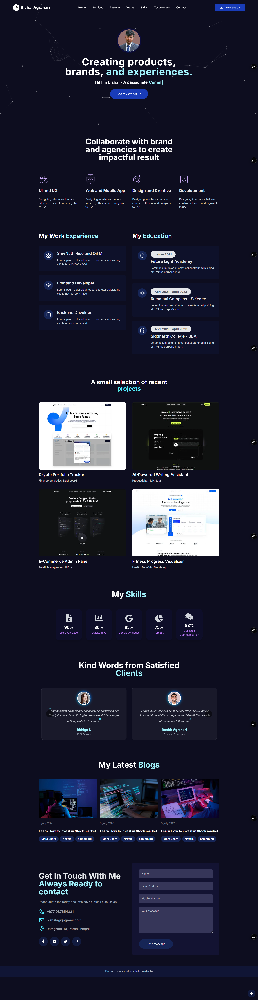

🌐 Personal Portfolio Website

A modern and responsive **personal portfolio website** built for my first client **Bishal Agrahari** using **Next.js**.
Designed to showcase skills, projects, and personal branding with a clean UI and smooth user experience.

## 🚀 Live Demo
🔗 https://personal-portfolio-using-next-js-five.vercel.app/

## 📸 Preview


> 📌 *Add a screenshot named `screenshot.png` in the root folder for this preview.*

## 🛠️ Tech Stack
- **Next.js**
- **React**
- **CSS / Modern UI**
- **:contentReference[oaicite:1]{index=1}** (Deployment)

## ✨ Highlights
- Fully responsive design
- Clean and minimal layout
- Fast performance & SEO-friendly
- Client-focused personal branding

## 📦 Deployment
Deployed seamlessly using **Vercel**.

---

💙 Built with passion while learning modern web development.

```

